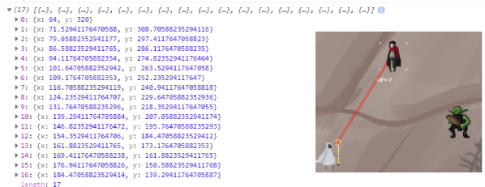

# Chaos

### Friday 06/25/2021 - Day 9 - 

Code found: https://developer.mozilla.org/en-US/docs/Web/JavaScript/Guide/Working_with_Objects#defining_getters_and_setters

Set up 'getters' that can monitor variable changes as they change. This is really useful for me so I can track the precise location of the cursor. mX.a and mY.a now hold the x and y positions of the cursor and are easy to access.

```javascript
// master track cursor - these have listeners on them for troubleshooting
mY = 0
mX = {
  aInternal: 0,  aListener: function(val) {},  set a(val) {    
  this.aInternal = val;    this.aListener(val);  
  },
  get a() {    return this.aInternal;  },  registerListener: function(listener) {
  this.aListener = listener;  
  }
}

mY = {
  bInternal: 0,  bListener: function(val) {},  set b(val) {
  this.bInternal = val;    this.bListener(val);  
  },
  get b() {    return this.bInternal;  },  registerListener: function(listener) {
  this.bListener = listener;  
  }
}

var theCursor = []
mX.registerListener(function(val) {  theCursor.x = val; console.log(theCursor)});
mY.registerListener(function(val) {  theCursor.y = val; console.log(theCursor)});
```

I modified the original a little, I use an array to store the actual position and to change the cursor, I just update mX.a or mY.b

```javascript
case 37: // left
current_state = 'left';
mX.a --
```


### Wednesday 06/23/2021 - Day 7

Today is a glorious day for I have worked out a way to do collition detection which is somewhat important in a game... 

I had a number of options that I was looking at including working out angles using all kinds of special math wizardry. But ended up using a simple trick that I stumbled on while looking at the canvas system.

```javascript
ct.globalAlpha = 0;
ct.rect(track[1].x, track[1].y, 64, 64);
ct.fill();
if( ct.isPointInPath(item.x, item.y)) {
 ct.clearRect(0, 0, canvas.width, canvas.height)
 cheeky = 4000
 boo = 1
}
```
isPointInPath came to my rescue and involves drawing an invisible square over the target sprite. The track of a weapon, like a magic bolt, its position is tracked along a specific path. The path is a dynamically generate path in an array of objects called listx.

```javascript
for(var i=1; i<maxFireFrame; i++)
  {
      mOb = {x:0,y:0}
      mOb.x = listx[i-1].x + stepsNeededX
      mOb.y = listx[i-1].y - stepsNeededY
      listx.push(mOb)
  }
```



The line in red is the path of the array listx. 

The invisible square is placed over the target sprite, and if the lines coordinates hit the target square, i.e. its 'isPointInPath' then we can detect true! A hit!

boo is used as a boolean to mark that a sprite has been hit
